<picture>
  <source media="(prefers-color-scheme: dark)" srcset="https://img.shields.io/badge/Windows_Server_2025-0078D6?style=for-the-badge&logo=windows&logoColor=white">
  
</picture>
<picture>
  <source media="(prefers-color-scheme: dark)" srcset="https://img.shields.io/badge/Active_Directory-005C97?style=for-the-badge&logo=microsoft&logoColor=white">
  
</picture>
<picture>
  <source media="(prefers-color-scheme: dark)" srcset="https://img.shields.io/badge/PowerShell-5391FE?style=for-the-badge&logo=powershell&logoColor=white">
  
</picture>
<picture>
  <source media="(prefers-color-scheme: dark)" srcset="https://img.shields.io/badge/VirtualBox-183A61?style=for-the-badge&logo=virtualbox&logoColor=white">
  
</picture>
<picture>
  <source media="(prefers-color-scheme: dark)" srcset="https://img.shields.io/badge/CIS_Controls-8B5CF6?style=for-the-badge&logo=cisco&logoColor=white">
  
</picture>

---

# 🖥️ Active Directory Help Desk Lab

> **A hands-on Active Directory lab simulating real IT Support / Help Desk workflows** — domain provisioning, automated user onboarding, layered access control, GPO hardening, and incident response — documented end-to-end with reasoning, screenshots, and a real incident report.

Built from scratch as part of my IT Infrastructure portfolio to demonstrate practical skills in **Windows Server administration**, **Active Directory**, **PowerShell automation**, **network configuration**, and **security hardening aligned to CIS Controls v8**.

---

## 📋 Table of Contents

- [Why This Project](#-why-this-project)
- [Architecture & Topology](#-architecture--topology)
- [Environment Setup](#-environment-setup)
- [What I Built — Step by Step](#-what-i-built--step-by-step)
- [Security Hardening (CIS Controls)](#-security-hardening-cis-controls)
- [Incident Report](#-incident-report-accidental-loss-of-domain-admin-access)
- [Key Takeaways](#-key-takeaways)
- [Roadmap](#-roadmap)
- [How to Reproduce](#-how-to-reproduce)

---

## 🎯 Why This Project

Most entry-level portfolios show isolated commands copied from a tutorial. This project is built around a **small fictional company** (2 departments, 6 users) and documents **the reasoning behind every configuration choice** — including one real incident that happened during the build and how it was diagnosed and fixed under pressure.

**What this project demonstrates:**
- ✅ Active Directory Domain Services deployment and configuration
- ✅ PowerShell automation for user provisioning (CSV-driven)
- ✅ Security groups, OU design, and GPO management
- ✅ NTFS vs Share permissions — defense in depth
- ✅ Static IP / DNS configuration for Domain Controllers
- ✅ Group Policy for USB storage restriction
- ✅ **Incident response**: recovering from accidental loss of Domain Admin access
- ✅ **Documentation**: clear, structured technical writing

---

## 🏗 Architecture & Topology

```
┌─────────────────────────────────────────────────────────────┐
│                         INTERNET                             │
└──────────────────────┬──────────────────────────────────────┘
                       │
                  ┌────┴────┐
                  │   NAT   │  ← VirtualBox NAT Adapter
                  └────┬────┘
                       │
              ┌────────┴────────┐
              │      DC01       │
              │  Windows Server │
              │  2025 Standard  │
              │                 │
              │  AD DS + DNS    │
              │  lab.local      │
              │  192.168.50.10  │
              │                 │
              │  ┌───────────┐  │
              │  │  IT Dept  │  │
              │  │ RRHH Dept │  │
              │  └───────────┘  │
              └────────┬────────┘
                       │
              ┌────────┴────────┐
              │ Internal Network │
              │  192.168.50.0/24 │
              │     (adlab)      │
              └─────────────────┘
```

**Design decisions:**
- **Dual network adapters**: NAT for internet access (Windows Update, downloads) + Internal Network (`adlab`) for domain traffic
- **Isolated internal segment**: lab misconfigurations can't leak onto the host's real network
- **Static IP (192.168.50.10)**: Domain Controllers need fixed addresses — DHCP would risk clients losing contact after a lease change
- **DNS pointing to itself (127.0.0.1)**: AD DS depends entirely on DNS to locate the domain

> 📸 **See the full network topology:** [`network-diagrams/`](./network-diagrams/)

---

## 🔧 Environment Setup

| Component | Choice | Rationale |
|-----------|--------|-----------|
| **Host** | Windows Server 2025 Standard (Evaluation) | Free evaluation, sufficient for lab |
| **Virtualization** | VirtualBox | Free, widely used in enterprise labs |
| **Disk Layout** | EFI (FAT32) + MSR + NTFS | Standard UEFI/GPT — Windows Setup default |
| **Networking** | NAT + Internal Network (`adlab`) | Internet isolation + domain traffic separation |
| **DC Static IP** | `192.168.50.10/24`, no gateway | Required for DC stability; no external route needed on isolated segment |
| **DNS** | `127.0.0.1` | DC serves its own DNS; no upstream on isolated segment |

> **🔧 Troubleshooting note:** `sconfig`'s interactive wizard wouldn't accept a blank gateway (it interprets empty input as cancel). Fixed via PowerShell using `New-NetIPAddress` / `Set-DnsClientServerAddress` where omitting `-DefaultGateway` simply leaves it unset.

---

## 📸 What I Built — Step by Step

Every step is documented with a screenshot. See [`screenshots/README.md`](./screenshots/README.md) for full descriptions.

| # | Step | Screenshot |
|---|------|------------|
| 01 | **Static IP Configuration** — Set 192.168.50.10/24, DNS 127.0.0.1 via PowerShell | 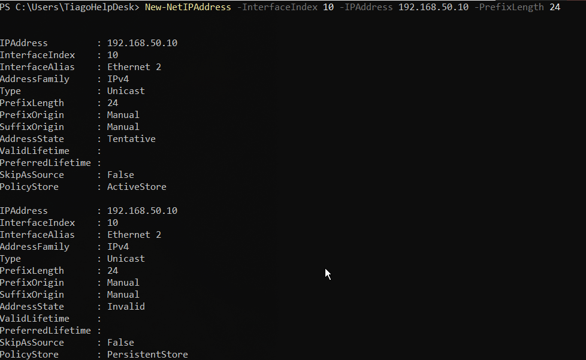 |
| 02 | **Installing Active Directory Domain Services** — AD DS role installation | 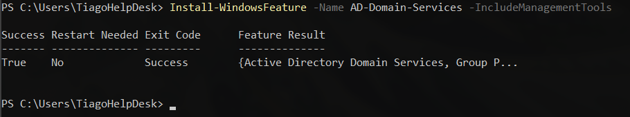 |
| 03 | **Promoted as Domain Controller** — New forest root for `lab.local` | 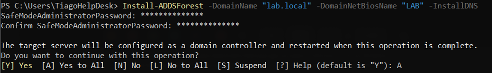 |
| 04 | **IT Organizational Unit** — Created OU for IT department structure | 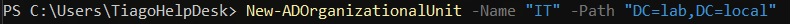 |
| 05 | **RRHH Organizational Unit** — Created OU for HR department |  |
| 06 | **Users CSV** — Employee data file driving the automation | 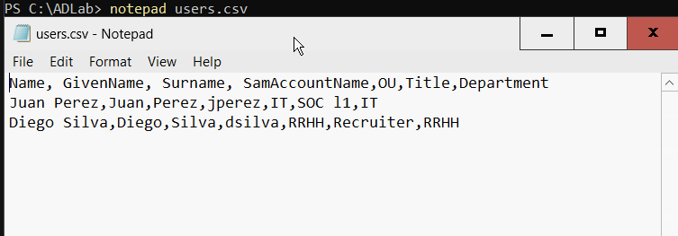 |
| 07 | **PowerShell User Creation** — Automated bulk user provisioning script | 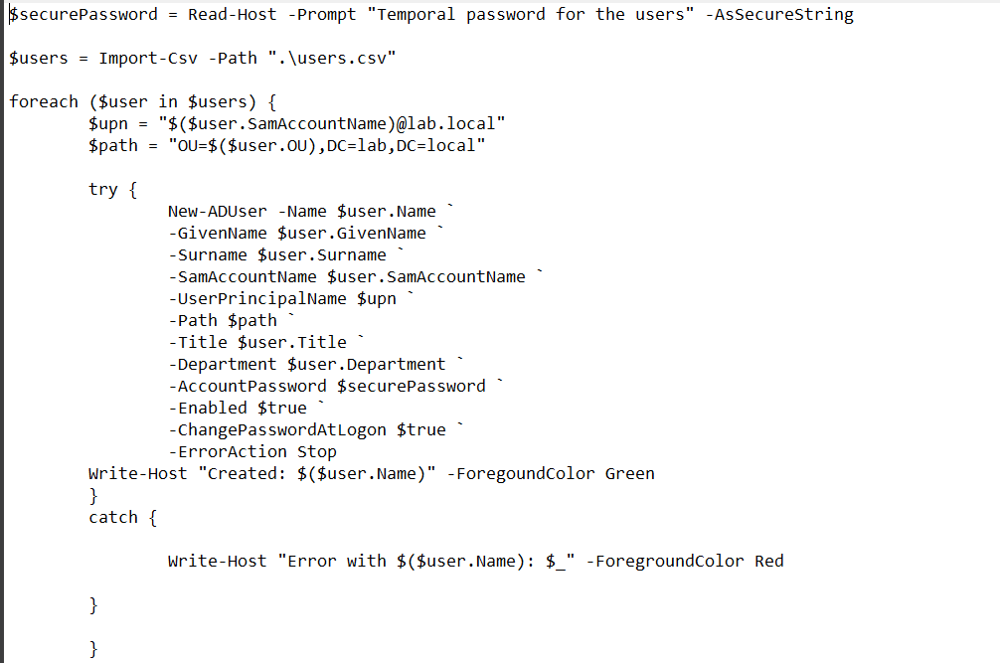 |
| 08 | **Script Execution Policy** — Allow local PowerShell scripts | 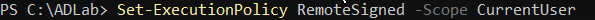 |
| 09 | **Creating Security Groups** — `IT-Support` and `RRHH-Team` groups | 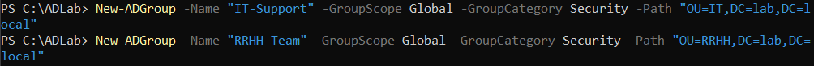 |
| 10 | **Users Added to Groups** — Membership assignment | 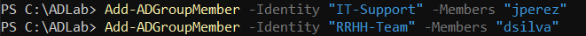 |
| 11 | **DNS Configuration** — Forward/reverse lookup zones | 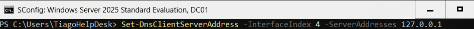 |
| 12 | **NTFS Permissions** — Modify permissions for RRHH-Team on RRHH-Docs | 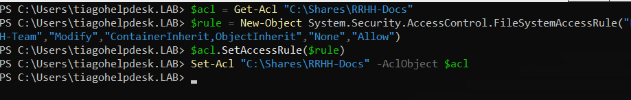 |
| 13 | **SMB Share Configuration** — Shared folder with Full Control for RRHH-Team | 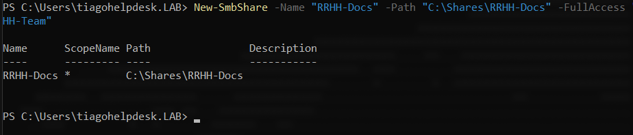 |
| 14 | **GPO — USB Storage Block** — Policy disabling USB storage on RRHH OUs | 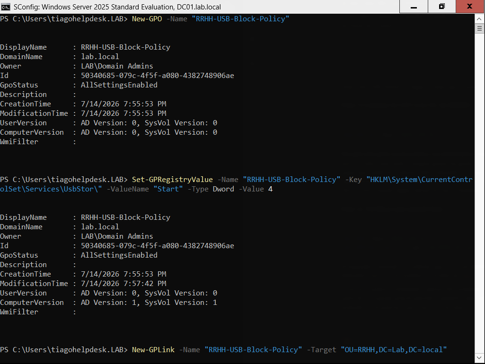 |

---

## 🛡️ Security Hardening (CIS Controls)

This project maps to **CIS Controls v8**, the industry-standard framework for cybersecurity defense:

### CIS Control 4 — Secure Configuration of Enterprise Assets and Software

> *"Disable auto-run and auto-mount for removable media devices."*

- **GPO Implementation**: Created `RRHH-USB-Block-Policy` linked to the RRHH OU, disabling the `UsbStor` driver (Start = 4) — preventing USB storage devices from mounting as usable drives
- **Scope**: Only targets the storage driver — keyboard, mouse, and other USB peripherals are unaffected
- **Business rationale**: Prevents data exfiltration via USB drives without breaking legitimate hardware

### CIS Control 6 — Access Control Management

> *"Use a least-privilege strategy for all access."*

- **Defense in depth**: Two independent permission layers on the `RRHH-Docs` share

| Layer | Applies To | Configured As | Effective |
|-------|-----------|--------------|-----------|
| NTFS | Any access (local + remote) | RRHH-Team → **Modify** | ⬆️ **More restrictive** |
| Share (SMB) | Network access only | RRHH-Team → **Full Control** | ⬇️ Overridden by NTFS |

- **Key insight**: The effective permission is always the *more restrictive of the two*. NTFS was set as the real ceiling (Modify — read/write/edit, no permission changes), while the share was left more permissive — a valid pattern once you understand which layer is enforcing the policy.

### CIS Control 8 — Incident Response Management (via Incident Report)

The real incident during this build (see below) demonstrates:
- Detection of anomalous AD behavior
- Diagnosis through command-line tools
- Containment and eradication by restoring admin access
- Root cause analysis and lesson documentation

---

## 🚨 Incident Report: Accidental Loss of Domain Admin Access

### What happened

While bulk-deleting test users with a filter on the `Title` attribute (`Get-ADUser -Filter * | Where-Object {$_.Title -ne $null}`), the filter unintentionally matched my own domain account — which also had a `Title` set. The account — and its Domain Admins membership — was **deleted while the session was still active**.

### Diagnosis

- `whoami` confirmed the active session token was still valid despite the account no longer existing in AD
- `Get-ADUser <my-account>` returned *"cannot find an object"*
- The built-in `Administrator` account (which cannot be removed from Domain Admins) remained available as a fallback

### Resolution

1. Logged in as `Administrator`
2. Recreated the deleted account
3. Re-added it to `Domain Admins`
4. Verified access before closing the original session

### Root cause & lesson

> **The filter was broader than intended.** It targeted "any user with a Title" with no exclusion for accounts that shouldn't be touched by a bulk operation.

**Prevention:** Destructive bulk operations against AD should always be scoped with:
- An explicit allow-list (not a broad attribute filter)
- A `-WhatIf` dry run first
- Exclusion of privileged accounts from bulk operations

---

## 💡 Key Takeaways

| Concept | What I Learned |
|---------|---------------|
| **OUs vs Groups** | OUs organize and scope policy; groups grant access — conflating them is a common early mistake |
| **NTFS + Share** | Two independent permission layers; the more restrictive one always wins |
| **Automation** | CSV-driven provisioning scales in a way manual config doesn't |
| **Bulk Operations** | Need explicit, narrow scoping — broad filters carry real risk |
| **Documentation** | Writing down the *why* behind each choice is as important as the config itself |

---

## 🗺️ Roadmap

- [x] Domain provisioning (AD DS + DNS)
- [x] OU structure (IT, RRHH departments)
- [x] Automated user onboarding (PowerShell + CSV)
- [x] Security groups and access control
- [x] NTFS + Share permissions (defense in depth)
- [x] GPO — USB storage restriction
- [x] Incident documentation
- [ ] ✅ **Join a Windows 10/11 client** to the domain to validate the full chain
- [ ] ✅ **Simulate Help Desk tickets** (account lockout, transfer, offboarding)
- [ ] ✅ **Track tickets in Jira** as a workflow layer

> ⚠️ *Note: I broke the VM during final testing before completing the roadmap items above. The core infrastructure is complete and functional — what remains is optional polish, not missing fundamentals.*

---

## 🧪 How to Reproduce

1. **Install VirtualBox** and create a VM with Windows Server 2025 (Evaluation)
2. **Configure dual adapters**: NAT (internet) + Internal Network named `adlab`
3. **Set static IP** via PowerShell:
   ```powershell
   New-NetIPAddress -InterfaceAlias "Ethernet" -IPAddress 192.168.50.10 -PrefixLength 24
   Set-DnsClientServerAddress -InterfaceAlias "Ethernet" -ServerAddresses 127.0.0.1
   ```
4. **Install AD DS** and promote to Domain Controller:
   ```powershell
   Install-WindowsFeature -Name AD-Domain-Services -IncludeManagementTools
   Install-ADDSForest -DomainName "lab.local"
   ```
5. **Run the provisioning script** from [`scripts/Create-Users.ps1`](./scripts/Create-Users.ps1) (uses [`users.csv`](./scripts/users.csv))
6. **Create security groups** and assign users
7. **Configure NTFS + Share permissions** on `RRHH-Docs`
8. **Create GPO** blocking USB storage via `UsbStor` driver disable

---

## 📁 Repository Structure

```
ActiveDirectory-HelpDesk-Lab/
├── README.md                          ← You are here
├── screenshots/
│   ├── README.md                      ← Screenshot descriptions
│   └── 01-14-*.png                    ← Step screenshots
├── network-diagrams/
│   ├── network-topology-overview.png
│   └── network-adapter-configuration.png
├── scripts/
│   ├── Create-Users.ps1              ← PowerShell user provisioning
│   └── users.csv                     ← Employee data
└── .gitignore
```

---

## 📬 Contact

**Tiago Colo Ceppone**  
📧 colotiago8@gmail.com  
🔗 [linkedin.com/in/tiago-colo](https://linkedin.com/in/tiago-colo)  

*This project is part of my IT Support & Infrastructure portfolio. Built from scratch for hands-on learning — no tutorials, no shortcuts.*
